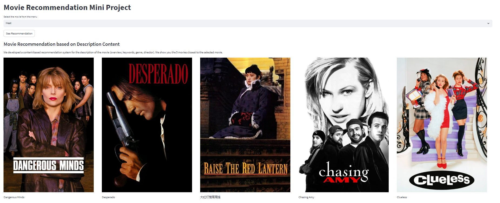

# Movie Recommendation System

This project aims to build a Movie Recommendation System using Content Filtering Recommendation and User-Based Filtering Recommendation techniques. The system is designed to provide personalized movie suggestions to users based on their preferences and historical interactions with movies.

## Content Filtering Recommendation

Content Filtering Recommendation is a technique that recommends movies based on their inherent characteristics and attributes. In this project, we use movie features such as genre, actors, directors, and plot summaries to create a content-based recommendation engine. By analyzing these features, the system suggests movies that are similar in content to the ones the user has shown interest in.

## User-Based Filtering Recommendation
User-Based Filtering Recommendation is a collaborative filtering technique that recommends movies based on the preferences and behavior of similar users. The system identifies users with similar movie tastes and suggests movies that have been highly rated or positively reviewed by those users but not yet seen by the current user.

## Netflix Movie Dataset

To train and evaluate the recommendation system, we utilized the Netflix Movie Dataset, a rich collection of movies, user ratings, and relevant information. This dataset enables us to create a robust and accurate recommendation system by learning from a diverse range of user preferences and movie characteristics.

## Live Deployment with Streamlit

The recommendation system has been integrated into a user-friendly web application using Streamlit. With Streamlit, users can interact with the system in real-time, receive movie recommendations, and explore different movie options effortlessly through a simple and intuitive interface.

## Getting Started

To run the Movie Recommendation System locally, follow these steps:

1. Clone the repository to your local machine.
2. Install the required dependencies by running `pip install -r requirements.txt`.
3. Run the application using `streamlit run app.py`.
4. Access the web application through your web browser at `http://localhost:8501`.

## Contributing

We welcome contributions to enhance the movie recommendation system. If you find any issues, have new ideas, or want to improve existing features, please feel free to open an issue or submit a pull request.

## License

This project is licensed under the MIT License - see the [LICENSE](LICENSE) file for details.

## Acknowledgments

We would like to express our gratitude to the creators of the Netflix Movie Dataset and Streamlit for providing the necessary resources and tools to build this recommendation system.
